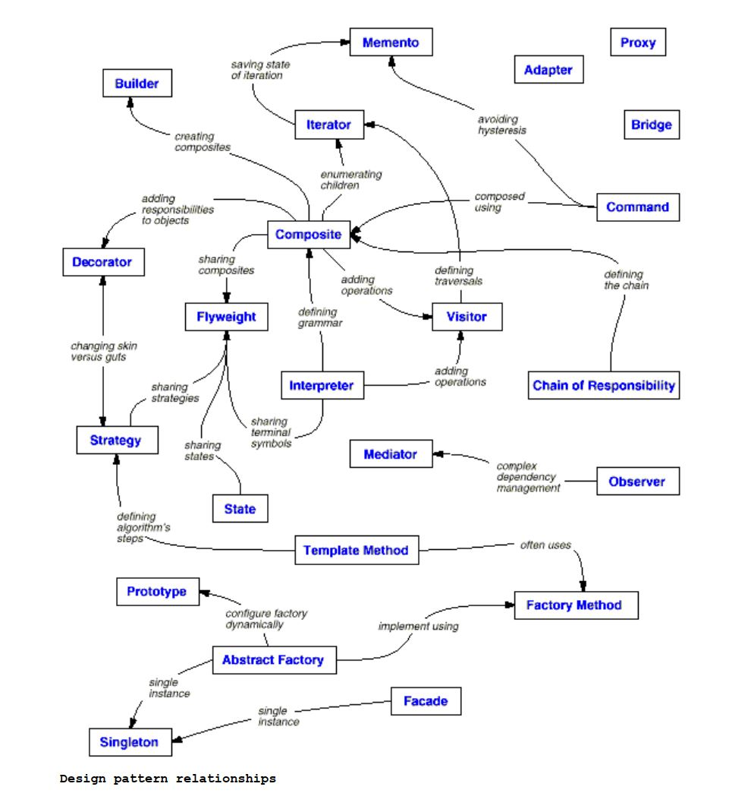

# Gang of Four Design Patterns

## What is Design Pattern?

I read lots of articles and books and I found the meaning of the design patterns in one sentence:
**Design Patterns solve common problems by providing typical solutions that have consequences and have trade-offs.**

Christopher Alexander says

> Each pattern describes a problem which occurs over and over again in our environment, and then describes the core of the solution to that problem, in such a way that you can use this solution a million times over, without ever doing it the same way twice  

The GOF design patterns are descriptions of communicating objects and classes that are customized to solve a general design problem in a particular context.  

### encapsulating the concept that varies!

Consider what should be variable in your design. This approach is the opposite of focusing on the causes of redesign. Instead of considering what might force a change to a design, consider what you want to be able to change without redesign. The focus is on encapsulating the concept that varies, a theme of many design patterns. 

|  Purpose   | Design Pattern Aspect(s)  |                        That can Vary                         |
| :--------: | :-----------------------: | :----------------------------------------------------------: |
| Creational |     Abstract Factory      |                 Families of product objects                  |
| Creational |          Builder          |             How to composite object gets created             |
| Creational |      Factory Method       |           subclass of object that is instantiated            |
| Creational |         Prototype         |             class of object that is instantiated             |
| Creational |         Singleton         |                 the sole instance of a class                 |
| Structural |          Adapter          |                    interface to an object                    |
| Structural |          Bridge           |                 implementation of an object                  |
| Structural |         Composite         |            structure and composition of an object            |
| Structural |         Decorator         |      responsibilities of an object without subclassing       |
| Structural |          Façade           |                   interface to a subsystem                   |
| Structural |         Flyweight         |                   storage costs of objects                   |
| Structural |           Proxy           |           how an object is accessed; its location            |
| Behavioral | Chain of responsibilities |              object that can fulfill a request               |
| Behavioral |          Command          |             when and how a request is fulfilled              |
| Behavioral |        Interpreter        |           grammar and interpretation of a language           |
| Behavioral |         Iterator          |     How an aggregate's elements are accessed, traversed      |
| Behavioral |         Mediator          |        how and which objects interact with each other        |
| Behavioral |          Memento          | what private information is stored outside an object, and when |
| Behavioral |         Observer          | number of objects that depend on another object; how the dependent objects stay up to date |
| Behavioral |           State           |                     states of an object                      |
| Behavioral |         Strategy          |                         an algorithm                         |
| Behavioral |      Template method      |                    steps of an algorithm                     |
| Behavioral |          Visitor          | operations that can be applied to object(s) without changing their subclass |

## Why we should use design pattern?

Design patterns make it easier to reuse successful designs and architectures. Expressing proven techniques as design patterns makes them more accessible to developers of new systems. Design patterns help you choose design alternatives that make a system reusable and avoid alternatives that compromise reusability. Design patterns can even improve the documentation and maintenance of existing systems by furnishing an explicit specification of class and object interactions and their underlying intent. Put simply, design patterns help a designer get a design "right" faster.  

## Design Patterns Criterion
### Purpose
So, In this criterion, It's reflects what a pattern does and most of the programmers use this criterion. In this criterion, patterns can have either creational, structural and behavioral purpose. 

 - Creational Patterns concern the process of object creation.
 - Structural Patterns deal with the composition of classes or objects.
 - Behavioral Patterns characterize the ways in which classes or objects interact and distribute responsibility.
### Scope
Scope specifies whether the pattern applies primarily to classes or objects. (Static vs Dynamic)

 - Class Patterns
	 1. they deal with the relationships between classes and their subclasses through **inheritance** so they are **static-fixed** at **compile-time**.
	 2.  They are focus on **class** relationships.
   
 - Object Patterns
	 1. most of the patterns are in Object scope.
	 2. They deal with **object-relationships** with can be changed at the **run-time** and are more **dynamic**.

## Design Patterns relationships

## Summary of all Design Patterns

* **Abstract Factory**
  Provide an interface for creating families of related or dependent objects without specifying their concrete classes.

* **Adapter**
  Convert the interface of a class into another interface clients expect. Adapter lets classes work together that couldn't otherwise because of incompatible interfaces.

* **Bridge**
  Decouple an abstraction from its implementation so that the two can vary independently.

* **Builder**
  Separate the construction of a complex object from its representation so that the same construction process can create different representations. 

* **Chain of Responsibility**
  Avoid coupling the sender of a request to its receiver by giving more than one object a chance to handle the request. Chain the receiving objects and pass the request along the chain until an object handles it.

* **Command**
  Encapsulate a request as an object, thereby letting you parameterize clients with different requests, queue or log requests, and support undoable operations.

* **Composite**
  Compose objects into tree structures to represent part-whole hierarchies. Composite lets clients treat individual objects and compositions of objects
  uniformly.

* **Decorator**
  Attach additional responsibilities to an object dynamically. Decorators provide a flexible alternative to subclassing for extending functionality.

* **Façade**
  Provide a unified interface to a set of interfaces in a subsystem. Façade defines a higher-level interface that makes the subsystem easier to use. 

* **Factory Method** 
  Define an interface for creating an object, but let subclasses decide which class to instantiate. Factory Method lets a class defer instantiation to subclasses.

* **Flyweight**
  Use sharing to support large numbers of fine-grained objects efficiently.

* **Interpreter**
  Given a language, define a representation for its grammar along with an interpreter that uses the representation to interpret sentences in the language.

* **Iterator**
  Provide a way to access the elements of an aggregate object sequentially without exposing its underlying representation.

* **Mediator**
  Define an object that encapsulates how a set of objects interact. Mediator promotes loose coupling by keeping objects from referring to each other explicitly, and it lets you vary their interaction independently.

* **Memento**
  Without violating encapsulation, capture and externalize an object's internal state so that the object can be restored to this state later.

* **Observer**
  Define a one-to-many dependency between objects so that when one object changes state, all its dependents are notified and updated automatically.

* **Prototype**
  Specify the kinds of objects to create using a prototypical instance, and create new objects by copying this prototype.

* **Proxy**
  Provide a surrogate or placeholder for another object to control access to it.

* **Singleton**
  Ensure a class only has one instance, and provide a global point of access to it.

* **State**
  Allow an object to alter its behavior when its internal state changes. The object will appear to change its class.

* **Strategy**
  Define a family of algorithms, encapsulate each one, and make them interchangeable. Strategy lets the algorithm vary independently from clients that use it.

* **Template Method**
  Define the skeleton of an algorithm in an operation, deferring some steps to subclasses. Template Method lets subclasses redefine certain steps of an algorithm without changing the algorithm's structure.

* **Visitor** 
  Represent an operation to be performed on the elements of an object structure. Visitor lets you define a new operation without changing the classes of the elements on which it operates.  

  

## Credits

1. Design Patterns: Elements of Reusable Object-Oriented Software  
